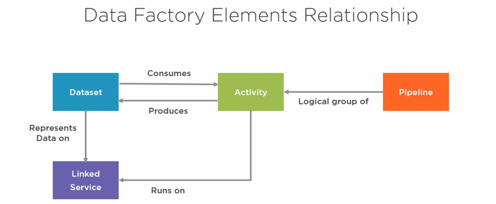

# Azure Data Factory
> Notes based on [this Pluralsight Course](https://app.pluralsight.com/library/courses/building-first-data-pipeline-azure-data-factory/table-of-contents )

## Azure Data Factory Overview
- Microsoft's main data engineering tool
- cloud-based *data integration* service (allowing new insight by bringing data together)
- orchestrate + automate data movement and data transformation, with over 80 different connectors
- .NET build option available
- No data storage itself - so need to persist data at the end of any process
- Elastic / Pay as you go model

## ETL vs ELT
Modern data engineering solutions tend to use one of two approaches:

### ETL (Extract, Transform, Load)
- used in traditional BI processes
- Transform before loading into DWH
- designed for reliability
- End result is data that is well-structured, compliant and easily queried

### ELT
- Transform carried out by DWH after load
- designed for agility
- good for experiments with several different options
- useful if business needs change frequently

**:point_right: Data Factory can fit with both approaches**, as it can be used in a modular fashion to:
- ingest data
- prepare data (cleanse etc.)
- transform or enrich data

...with the end result being served from a data warehouse and consumed by analytics applications

## Data Factory Elements
1. **Pipelines** = a logical grouping of data engineering steps; deployment and scheduling are performed at the pipeline level (rather than for individual steps)
2. **Activities** = the steps in the pipeline that comprise the actual work (copy, move, transform, enrich...)
    - Data Movement (via connectors)
    - Data Transformation (via Data Flows or external services)
    - Data Control (pipeline flow logic)
3. **Triggers** = when the pipeline should be executed
4. **Integration runtimes** = where the action happens (?)
5. **Datasets** = representations of the data you're working with (files, SQL tables...)
6. **Linked services** = connections to the actual data (in its stored form) to be operated on

